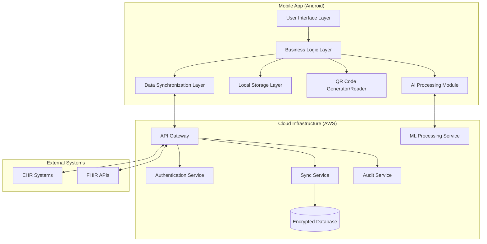
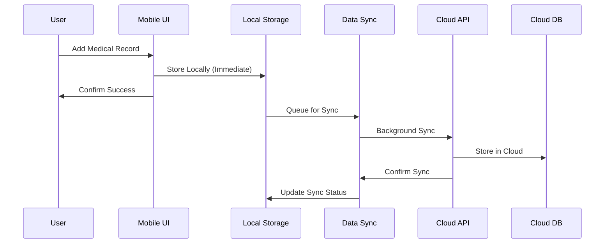
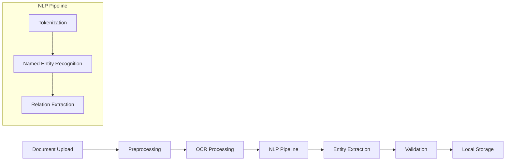
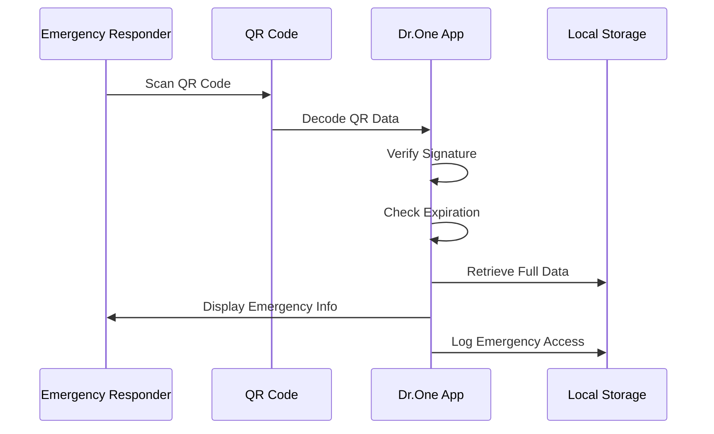

# Design Document

## Overview

Dr.One is an offline-first, mobile healthcare application that provides secure, patient-controlled access to critical medical information. The system employs a hybrid architecture combining local-first data storage with cloud synchronization, ensuring emergency access even without internet connectivity. The AI component uses lightweight transformer-based NLP for medical entity extraction and summarization, strictly limited to assistive functions without diagnostic capabilities.

The architecture prioritizes data ownership by patients, implements append-only medical records for immutability, and provides role-based access control for healthcare providers. Emergency access is facilitated through QR codes that work offline, displaying only critical medical information.

## Architecture

### High-Level System Architecture

Figure 1: High-Level System Architecture

[Mobile app (offline), local encrypted storage, cloud backend (auth, sync, audit), AI services, emergency QR access]

High-level architecture of Dr.One illustrating offline-first mobile access, secure cloud synchronization, and AI-assisted processing.



### Offline-First Architecture Pattern

The system implements a **local-first** architecture where:
- All critical data is stored locally using SQLite with encryption
- UI reads from local storage immediately (no loading states)
- Network operations happen in background with optimistic updates
- Conflict resolution handles simultaneous updates from multiple devices
- Emergency QR codes work entirely offline using local data

### Data Flow Architecture

Figure 2: End-to-End Patient Data Flow

[Patient uploads data, local encryption, AI extraction, append-only storage, cloud sync, doctor read-only access]

End-to-end flow showing how patient data is securely captured, processed by AI, stored immutably, and accessed by healthcare providers.



## Components and Interfaces

### Core Components

#### 1. Patient Profile Manager
**Responsibilities:**
- Manage patient demographic information
- Handle profile photo storage and encryption
- Validate and store emergency contact information
- Manage allergy and chronic condition data

**Interfaces:**
```typescript
interface PatientProfileManager {
  updateProfile(profile: PatientProfile): Promise<void>
  getProfile(): PatientProfile
  addAllergy(allergy: AllergyInfo): Promise<void>
  addChronicCondition(condition: ChronicCondition): Promise<void>
  validateProfileData(profile: PatientProfile): ValidationResult
}
```

#### 2. Medical Records Repository
**Responsibilities:**
- Implement append-only storage pattern
- Handle document upload and parsing
- Maintain audit trail for all record operations
- Provide search and retrieval capabilities

**Interfaces:**
```typescript
interface MedicalRecordsRepository {
  addRecord(record: MedicalRecord): Promise<string>
  getRecords(filter: RecordFilter): Promise<MedicalRecord[]>
  uploadDocument(document: File): Promise<ParsedDocument>
  getAuditTrail(recordId: string): Promise<AuditEntry[]>
}
```

#### 3. AI Medical Summarizer
**Responsibilities:**
- Generate clinical summaries from patient data
- Extract medical entities from uploaded documents
- Provide drug interaction analysis
- Ensure all outputs include appropriate disclaimers

**Interfaces:**
```typescript
interface AIMedicalSummarizer {
  generateSummary(patientData: PatientData): Promise<MedicalSummary>
  extractEntities(document: string): Promise<MedicalEntity[]>
  checkDrugInteractions(medications: Medication[]): Promise<InteractionAlert[]>
  checkAllergyConflicts(medication: Medication, allergies: Allergy[]): Promise<AllergyAlert[]>
}
```

#### 4. Emergency QR System
**Responsibilities:**
- Generate offline-accessible QR codes
- Encode critical medical information
- Handle QR code scanning and decoding
- Manage emergency access logging

**Interfaces:**
```typescript
interface EmergencyQRSystem {
  generateEmergencyQR(criticalInfo: CriticalMedicalInfo): Promise<string>
  decodeEmergencyQR(qrData: string): Promise<CriticalMedicalInfo>
  logEmergencyAccess(accessInfo: EmergencyAccessLog): Promise<void>
  validateQRIntegrity(qrData: string): boolean
}
```

#### 5. Data Synchronization Engine
**Responsibilities:**
- Handle offline-online data synchronization
- Implement conflict resolution strategies
- Manage sync queues and retry logic
- Ensure data consistency across devices

**Interfaces:**
```typescript
interface DataSynchronizationEngine {
  syncToCloud(): Promise<SyncResult>
  syncFromCloud(): Promise<SyncResult>
  resolveConflicts(conflicts: DataConflict[]): Promise<ConflictResolution[]>
  queueForSync(operation: SyncOperation): void
}
```

#### 6. Security and Access Control Manager
**Responsibilities:**
- Implement role-based access control
- Handle patient consent management
- Manage encryption/decryption operations
- Maintain audit logs for compliance

**Interfaces:**
```typescript
interface SecurityManager {
  authenticateUser(credentials: UserCredentials): Promise<AuthResult>
  checkPermissions(user: User, resource: Resource, action: Action): boolean
  encryptData(data: any): Promise<EncryptedData>
  decryptData(encryptedData: EncryptedData): Promise<any>
  logAccess(accessLog: AccessLogEntry): Promise<void>
}
```

## Data Models

Figure 3: Simplified Entity Relationship Diagram

[Patient, MedicalRecord, Prescription, Allergy, Consent, AuditLog with high-level relationships]

Simplified ER diagram representing patient-owned data, append-only medical records, consent relationships, and audit logging.

### Core Data Structures

#### Patient Profile
```typescript
interface PatientProfile {
  id: string
  name: string
  photo?: EncryptedBlob
  dateOfBirth: Date
  gender: Gender
  bloodGroup: BloodGroup
  emergencyContact: EmergencyContact
  allergies: Allergy[]
  chronicConditions: ChronicCondition[]
  createdAt: Date
  updatedAt: Date
  version: number
}
```


#### Medical Record
```typescript
interface MedicalRecord {
  id: string
  patientId: string
  type: RecordType // PRESCRIPTION | VACCINATION | DIAGNOSTIC | LAB_RESULT
  title: string
  description: string
  date: Date
  provider: HealthcareProvider
  documents: Document[]
  extractedEntities: MedicalEntity[]
  metadata: RecordMetadata
  createdAt: Date
  createdBy: string
  auditTrail: AuditEntry[]
}
```

#### Medical Summary
```typescript
interface MedicalSummary {
  patientId: string
  criticalAllergies: Allergy[]
  activeConditions: ChronicCondition[]
  currentMedications: Medication[]
  bloodGroup: BloodGroup
  emergencyContact: EmergencyContact
  lastUpdated: Date
  generatedAt: Date
  disclaimer: string
  aiConfidenceScore: number
}
```

#### Emergency QR Data
```typescript
interface EmergencyQRData {
  patientId: string
  name: string
  bloodGroup: BloodGroup
  criticalAllergies: string[]
  emergencyContact: EmergencyContact
  currentMedications: string[]
  chronicConditions: string[]
  generatedAt: Date
  expiresAt: Date
  checksum: string
}
```

### Database Schema Design

The system uses SQLite for local storage with the following key tables:

- **patients**: Core patient profile information
- **medical_records**: Append-only medical records with versioning
- **documents**: Encrypted document storage with metadata
- **sync_queue**: Operations pending cloud synchronization
- **audit_log**: Comprehensive audit trail for compliance
- **ai_cache**: Cached AI-generated summaries and extractions

## AI Pipeline Design

### Medical Entity Extraction Pipeline



### AI Processing Components

#### 1. Document Preprocessing
- PDF/image text extraction using OCR
- Text normalization and cleaning
- Medical abbreviation expansion
- Format standardization

#### 2. Medical NLP Pipeline
Based on research findings, the system will use:
- **Lightweight BERT-based models** for clinical entity recognition
- **Apache cTAKES** integration for medical concept extraction
- **Custom fine-tuned models** for prescription parsing
- **Rule-based post-processing** for validation and correction

#### 3. Entity Types Extracted
- **Medications**: Drug names, dosages, frequencies, routes
- **Conditions**: Diagnoses, symptoms, chronic conditions
- **Procedures**: Medical procedures, tests, surgeries
- **Allergies**: Drug allergies, environmental allergies
- **Vital Signs**: Blood pressure, heart rate, temperature
- **Lab Results**: Test names, values, reference ranges

#### 4. Safety Analysis Engine
- **Drug-Drug Interactions**: Cross-reference against interaction databases
- **Drug-Allergy Conflicts**: Match medications against patient allergies
- **Dosage Validation**: Check for appropriate dosing ranges
- **Contraindication Alerts**: Identify potential contraindications

### AI Ethics and Limitations Implementation

All AI outputs include:
- Clear "Assistive Information Only" headers
- Disclaimers about non-diagnostic nature
- Confidence scores for extracted information
- Recommendations to consult healthcare providers
- Audit trails for all AI decisions

## Security and Privacy Design

### Encryption Strategy

#### Data at Rest
- **AES-256 encryption** for all local SQLite databases
- **Individual field encryption** for sensitive data (SSN, photos)
- **Key derivation** from user biometrics + device-specific keys
- **Secure key storage** using Android Keystore

#### Data in Transit
- **TLS 1.3** for all API communications
- **Certificate pinning** to prevent man-in-the-middle attacks
- **End-to-end encryption** for sensitive data transfers
- **API request signing** using HMAC-SHA256

### Access Control Architecture

#### Role-Based Access Control (RBAC)
```typescript
enum UserRole {
  PATIENT = "patient",
  DOCTOR = "doctor", 
  NURSE = "nurse",
  EMERGENCY_RESPONDER = "emergency_responder"
}

interface Permission {
  resource: string
  actions: Action[]
  conditions?: AccessCondition[]
}

interface AccessPolicy {
  role: UserRole
  permissions: Permission[]
}
```

#### Patient Consent Management
- **Granular consent** for different data types
- **Time-limited access** with automatic expiration
- **Revocable permissions** that take effect immediately
- **Audit trail** of all consent changes

### HIPAA Compliance Implementation

#### Technical Safeguards
- **Unique user identification** with multi-factor authentication
- **Automatic logoff** after configurable inactivity periods
- **Encryption and decryption** of all PHI
- **Audit controls** with tamper-proof logging

#### Administrative Safeguards
- **Security officer** designation and responsibilities
- **Workforce training** on privacy and security
- **Access management** procedures and policies
- **Risk assessment** and management programs

#### Physical Safeguards
- **Device controls** for mobile device security
- **Workstation use** restrictions and monitoring
- **Media controls** for data storage and disposal

## Offline QR Design

### QR Code Generation Strategy

#### Data Compression and Encoding
```typescript
interface QRDataStructure {
  version: number // QR format version
  patientHash: string // Anonymized patient identifier
  criticalData: CompressedMedicalData
  timestamp: number
  checksum: string
  signature: string // Digital signature for integrity
}
```

#### Compression Algorithm
1. **JSON serialization** of critical medical data
2. **GZIP compression** to reduce data size
3. **Base64 encoding** for QR compatibility
4. **Error correction** using Reed-Solomon codes
5. **Digital signing** for tamper detection

#### QR Code Specifications
- **Version**: QR Code Version 10 (57x57 modules)
- **Error Correction**: Level H (30% recovery capability)
- **Data Capacity**: Up to 1,852 bytes
- **Encoding**: UTF-8 with Base64 encoding
- **Refresh Interval**: 24 hours for security

### Emergency Access Workflow



### Offline Data Synchronization

#### Sync Conflict Resolution
1. **Last-Writer-Wins** for profile updates
2. **Append-Only** for medical records (no conflicts)
3. **Vector Clocks** for ordering operations
4. **Manual Resolution** for complex conflicts

#### Sync Queue Management
- **Priority queuing** with emergency data first
- **Exponential backoff** for failed sync attempts
- **Batch operations** to optimize network usage
- **Integrity checks** before and after sync

## Future Extensibility

Figure 4: Application UI and Workflow Overview

#### Patient Dashboard


[Patient Dashboard - Shows Niket Thakur's profile (22y, Male, A+ blood type, 1 allergy) with menu options including My Profile, Medical Records, My Prescriptions, AI Medical Summary (highlighted in blue), Upload Prescription, and Emergency QR Code (highlighted in red). Bottom navigation shows Home, Records, Reminders, AI, and Profile tabs.]

*Caption: Patient dashboard interface displaying comprehensive health management options including profile access, medical records, prescription management, and emergency QR code generation.*

#### AI Medical Summary Screen


[AI Medical Summary - Shows Akash Kumar's medical summary (23y, Male, A+ blood type) with Critical Allergies section displaying "Insect stings (bees, wasps)", "Airborne (dust mites, mold, pet dander)", and "Foods (peanuts, milk, wheat)". Chronic Conditions section shows "Diabetes: High blood sugar requiring diet/exercise/medication" and "Arthritis: Joint inflammation causing pain and limited mobility". Current Medications shows "No active medications". Includes AI Disclaimer at bottom.]

*Caption: AI-generated medical summary screen showing critical patient information including allergies, conditions, medications, and required medical disclaimers for healthcare staff review.*

#### Emergency QR Code Screen


[Emergency QR Code Screen - Shows large QR code in center with "Emergency Medical QR" title, "Valid for 29 minutes" timer, patient name "Niket Thakur" (22y, Male), A+ blood type indicator, Critical Information section with Allergies showing "NA" and Conditions showing "NA". Includes Refresh and Share buttons, with "Works Offline" indicator at top.]

*Caption: Emergency QR code screen providing offline access to critical medical information including patient details, allergies, and conditions for emergency responders.*

#### Doctor Dashboard


[Doctor Dashboard - Shows "Welcome, Dr. Priyanka Singh" in Medical Staff Portal with "How to Access Patient Records" instructions: 1) Ask patient to show Emergency QR code, 2) Scan QR code with device camera or receive shared link, 3) View AI summary, patient history, and add prescriptions. Quick Actions include "Scan Patient QR" with camera icon, "My Profile" for updating doctor profile, "Refill Requests" showing "No pending refill requests", and "Doctor Access Permissions" section.]

*Caption: Healthcare provider dashboard demonstrating streamlined access to patient records through QR code scanning, with clear instructions for medical staff workflow.*

Prototype screens demonstrating patient interaction, AI-assisted medical summary, emergency QR access, and doctor workflow integration.

### Planned Integrations

#### Wearable Device Integration
- **Fitness trackers** for continuous vital signs
- **Glucose monitors** for diabetic patients
- **Heart rate monitors** for cardiac patients
- **Sleep trackers** for sleep disorder monitoring

#### EHR System Integration
- **FHIR R4 compliance** for interoperability
- **HL7 message processing** for data exchange
- **Epic MyChart integration** for major health systems
- **Cerner PowerChart integration** for hospital systems

#### Advanced AI Capabilities
- **Longitudinal health analysis** for trend detection
- **Risk stratification** for preventive care
- **Drug efficacy tracking** based on patient outcomes
- **Personalized health recommendations** (informational only)

### Scalability Considerations

#### Performance Optimization
- **Database indexing** for fast local queries
- **Lazy loading** for large document collections
- **Background processing** for AI operations
- **Caching strategies** for frequently accessed data

#### Infrastructure Scaling
- **Microservices architecture** for cloud components
- **Auto-scaling** based on user load
- **CDN integration** for document storage
- **Multi-region deployment** for global availability

### API Design for Extensibility

#### RESTful API Structure
```
/api/v1/patients/{patientId}
/api/v1/patients/{patientId}/records
/api/v1/patients/{patientId}/summary
/api/v1/patients/{patientId}/emergency-qr
/api/v1/ai/extract-entities
/api/v1/ai/check-interactions
/api/v1/sync/upload
/api/v1/sync/download
```

#### Webhook Support
- **Record updates** for real-time notifications
- **Emergency access** alerts for patient notification
- **Sync completion** events for client updates
- **Security events** for audit and monitoring

This design provides a robust foundation for Dr.One while maintaining flexibility for future enhancements and ensuring compliance with healthcare regulations and security requirements.

## Correctness Properties

*A property is a characteristic or behavior that should hold true across all valid executions of a system—essentially, a formal statement about what the system should do. Properties serve as the bridge between human-readable specifications and machine-verifiable correctness guarantees.*

### Property 1: Patient Profile Completeness
*For any* patient profile created in the system, it must contain all required fields: name, age, gender, blood group, emergency contact, allergies, and chronic conditions, with proper data type validation.
**Validates: Requirements 1.1, 1.2**

### Property 2: Append-Only Medical Records
*For any* medical record (prescription, vaccination, diagnostic report, allergy, or chronic condition), once stored in the system, it cannot be modified or deleted, only new records can be appended.
**Validates: Requirements 1.3, 1.4, 2.1, 2.3, 2.5, 10.5**

### Property 3: Role-Based Access Control Enforcement
*For any* medical staff user attempting to perform operations on patient data, the system shall only allow read-only and add-only operations, preventing any editing or deletion of patient profiles or existing medical records.
**Validates: Requirements 1.5, 6.1, 6.3**

### Property 4: Document Parsing and Entity Extraction
*For any* uploaded medical document (prescription or diagnostic report), the parser shall extract relevant medical entities (medications, dosages, findings) and allow patient review before storage.
**Validates: Requirements 2.2, 9.1, 9.2, 9.4, 9.5**

### Property 5: Comprehensive Audit Logging
*For any* system operation (authentication, data access, record addition, safety check), the system shall create immutable audit log entries containing timestamp, user identity, and operation details.
**Validates: Requirements 2.4, 4.5, 6.5, 11.1, 11.2, 11.3, 11.4, 11.5**

### Property 6: AI Medical Summary Generation
*For any* patient data, when a medical summary is requested, the AI system shall generate a summary highlighting allergies, chronic conditions, current medications, and blood group within the specified time constraints.
**Validates: Requirements 3.1**

### Property 7: AI Content Restrictions
*For any* AI-generated output (summary, alert, or analysis), the system shall never include diagnostic recommendations, prescription suggestions, or treatment advice.
**Validates: Requirements 3.3, 12.4**

### Property 8: AI Disclaimer Requirements
*For any* AI-generated content, the output must include clear disclaimers marking it as "assistive information only," "not for diagnostic purposes," and "informational only" with appropriate medical limitations.
**Validates: Requirements 3.4, 12.1, 12.3, 12.5**

### Property 9: Prescription Safety Checking
*For any* new prescription entered by medical staff, the system shall automatically analyze for drug-drug interactions and drug-allergy conflicts, displaying informational warnings without preventing entry.
**Validates: Requirements 4.1, 4.2, 4.3, 4.4**

### Property 10: Offline Emergency QR Access
*For any* patient's critical medical information, the emergency QR code shall provide offline access to allergies, chronic conditions, current medications, blood group, and emergency contact without requiring authentication or internet connectivity.
**Validates: Requirements 5.1, 5.2, 5.3**

### Property 11: Emergency Access Audit Trail
*For any* emergency mode access, when connectivity is restored, the system shall automatically log the access attempt with appropriate details for audit purposes.
**Validates: Requirements 5.5**

### Property 12: Patient Consent Management
*For any* medical staff request to access patient data, the system shall require explicit patient consent before granting access.
**Validates: Requirements 6.2**

### Property 13: Offline-First Data Access
*For any* critical patient data, the system shall store it locally and prioritize local access over network requests, especially in emergency scenarios.
**Validates: Requirements 7.1, 7.2, 7.4**

### Property 14: Data Synchronization Integrity
*For any* offline changes made to patient data, when connectivity is restored, the system shall synchronize with the cloud backend while maintaining data integrity and consistency.
**Validates: Requirements 7.3, 7.5**

### Property 15: Emergency UI Accessibility
*For any* emergency mode activation, the interface shall display critical information with large, readable fonts and provide access to emergency functions within 2 taps from the main screen.
**Validates: Requirements 8.2, 8.3**

### Property 16: Vaccination Record Management
*For any* vaccination record, the system shall store complete information (vaccine name, date, facility), validate vaccine names against standard databases, and include relevant vaccinations in AI-generated summaries.
**Validates: Requirements 10.1, 10.2, 10.3, 10.4**

## Error Handling

### Error Categories and Responses

#### 1. Network Connectivity Errors
- **Offline Mode Activation**: Automatically switch to offline mode when network is unavailable
- **Sync Queue Management**: Queue operations for later synchronization with exponential backoff
- **User Notification**: Inform users of offline status without disrupting workflow
- **Emergency Access**: Ensure QR codes continue to function without network dependency

#### 2. Data Validation Errors
- **Input Validation**: Provide clear error messages for invalid data formats
- **Medical Entity Validation**: Flag uncertain extractions for manual review
- **Consent Validation**: Block access attempts without proper patient consent
- **Role Permission Errors**: Clearly communicate access restrictions to users

#### 3. AI Processing Errors
- **Extraction Failures**: Gracefully handle documents that cannot be parsed
- **Summary Generation Errors**: Provide fallback summaries with available data
- **Safety Check Failures**: Default to conservative warnings when analysis fails
- **Confidence Thresholds**: Flag low-confidence AI outputs for manual review

#### 4. Security and Privacy Errors
- **Authentication Failures**: Implement secure lockout policies with audit logging
- **Encryption Errors**: Fail securely and prevent data exposure
- **Access Control Violations**: Log and block unauthorized access attempts
- **Audit Log Integrity**: Detect and respond to tampering attempts

#### 5. Data Synchronization Errors
- **Conflict Resolution**: Implement clear strategies for data conflicts
- **Partial Sync Failures**: Handle incomplete synchronization gracefully
- **Data Corruption**: Detect and recover from corrupted data scenarios
- **Version Mismatch**: Handle schema changes during synchronization

## Testing Strategy

### Dual Testing Approach

The Dr.One system requires comprehensive testing using both unit tests and property-based tests to ensure correctness, security, and reliability in healthcare scenarios.

#### Unit Testing Focus Areas

**Specific Examples and Edge Cases:**
- Emergency scenarios with specific patient conditions (severe allergies, multiple chronic conditions)
- Document parsing with real-world prescription formats and edge cases
- Authentication flows with various user roles and permission combinations
- QR code generation and scanning with different data sizes and formats
- Sync conflict resolution with specific data conflict scenarios

**Integration Points:**
- AI model integration with medical entity extraction pipelines
- Cloud synchronization with offline data reconciliation
- Security layer integration with encryption and access control
- External API integration with EHR systems and FHIR endpoints

**Error Conditions:**
- Network failures during critical operations
- Malformed medical documents and parsing failures
- Invalid user inputs and data validation scenarios
- Security violations and unauthorized access attempts

#### Property-Based Testing Configuration

**Testing Framework:** Use **Hypothesis** (Python) or **fast-check** (TypeScript/JavaScript) for property-based testing
**Minimum Iterations:** 100 iterations per property test to ensure comprehensive input coverage
**Test Tagging:** Each property test must reference its design document property using the format:
**Feature: dr-one, Property {number}: {property_text}**

**Property Test Implementation Requirements:**
- Each correctness property must be implemented as a single property-based test
- Tests must generate random but valid input data representative of real healthcare scenarios
- Property tests should focus on universal behaviors that must hold across all inputs
- All property tests must include appropriate medical data generators (synthetic patient data, medical documents, etc.)

**Example Property Test Structure:**
```python
@given(patient_profile=patient_profile_strategy())
def test_patient_profile_completeness(patient_profile):
    """Feature: dr-one, Property 1: Patient Profile Completeness"""
    result = create_patient_profile(patient_profile)
    assert all(required_field in result for required_field in REQUIRED_FIELDS)
    assert validate_data_types(result) == True
```

#### Test Data Generation

**Synthetic Medical Data:**
- Generate realistic but synthetic patient profiles with diverse demographics
- Create varied medical documents (prescriptions, lab reports, vaccination records)
- Produce realistic medication lists with potential interactions and allergies
- Generate emergency scenarios with different criticality levels

**Security Test Data:**
- Create various user roles and permission combinations
- Generate authentication scenarios including failure cases
- Produce access control test cases with boundary conditions
- Create audit log scenarios with different operation types

#### Compliance Testing

**HIPAA Compliance Verification:**
- Audit log completeness and tamper-proof verification
- Encryption verification for data at rest and in transit
- Access control enforcement across all user roles
- Patient consent management and revocation scenarios

**Healthcare Workflow Testing:**
- Emergency access scenarios without authentication
- Medical staff workflow integration and limitations
- Patient data ownership and control verification
- AI ethics and limitation compliance testing

### Testing Environment Requirements

**Mobile Testing:**
- Android device testing across different versions and screen sizes
- Offline functionality testing with network simulation
- QR code scanning testing under various lighting conditions
- Touch interface testing for emergency scenarios

**Cloud Infrastructure Testing:**
- API endpoint testing with various load conditions
- Data synchronization testing with network interruptions
- Security testing including penetration testing
- Backup and recovery testing for data integrity

**Performance Testing:**
- AI processing speed verification (3-second summary generation)
- Offline data access performance testing
- Large document parsing performance verification
- Concurrent user access testing for cloud components

This comprehensive testing strategy ensures that Dr.One meets the highest standards for healthcare applications while maintaining usability, security, and regulatory compliance.